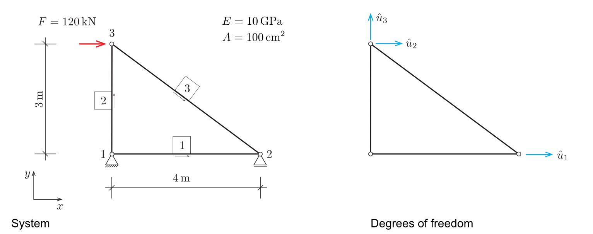

# Object-oriented analysis

In this section, the required classes and their responsibilities are identified. For that, we go through the steps of a finite analysis at hand of the simple truss structure depicted in @fig-system-example. We follow the classical procedure where the structural model is established in the preprocessing phase, the deformation of the system is computed in the processing step and derived results such as stresses are computed, listed and visualized in postprocessing.

{#fig-system-example}

## Preprocessing {#sec-analysis-preprocessing}

In preprocessing, the model of the `Structure` to be analyzsed is established. The `Structure` comprises `Node`s and `Element`s. Each `Node` has a position represented by a `Vector`, a `Constraint` and a `Force`. An `Element` has a cross-sectional area $A$, Young's modulus $E$ and is connected to its two `Node`s.

The `Structure` class is responsible for managing its `Node`s and `Element`s. It provides methods to add nodes and elements and to print the structure.

An additional `Visualizer` class provides methods to visualize the structure and lateron the results of the analysis. The `Visualizer` class is not part of the core analysis but is useful for understanding and presenting the results.

## Processing

The structural analysis comprises the following steps:

1. Enumerate degrees of freedom taking into account imposed constraints
    - Enumeration takes place on the system and the node level
    - As a result, we get the total number of degrees of freedom
1. Create global stiffness matrix and load vector filled with zeros. 
1. For each element, compute the element stiffness matrix and assemble it into system matrix. Useful:
    - length of the element
    - unit vector $\mathbf{e}_1$ in element direction
1. Assemble the global load vector from applied forces using element and node degrees of freedom
1. Solve linear system $\mathbf{K}\mathbf{u} = \mathbf{r}$
1. Store nodal displacement vectors

## Postprocessing

In the postprocessing step, we want to

1. List nodal displacements and element forces
1. Visualize the deformation of the system
1. Display element axial forces 

In the following section, you will be guided step by step through the design and implementation of the steps above.
