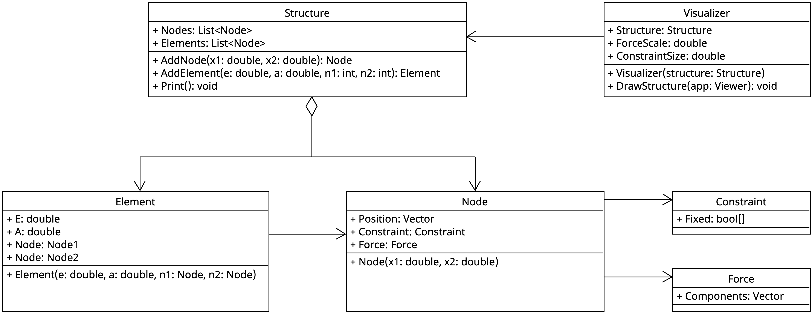
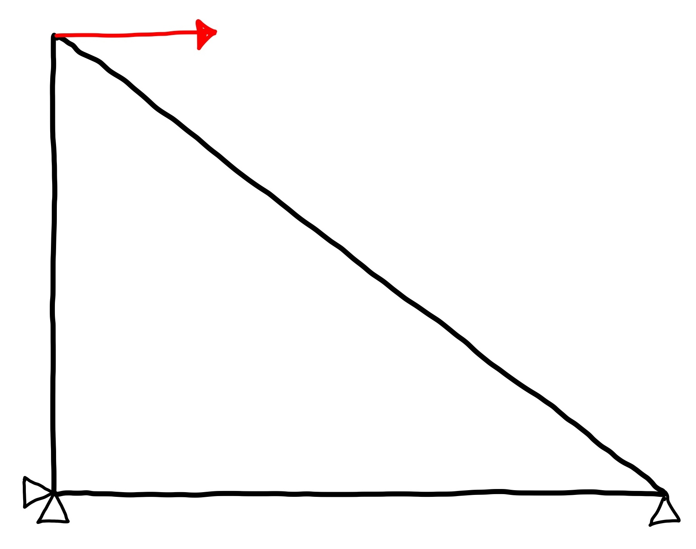
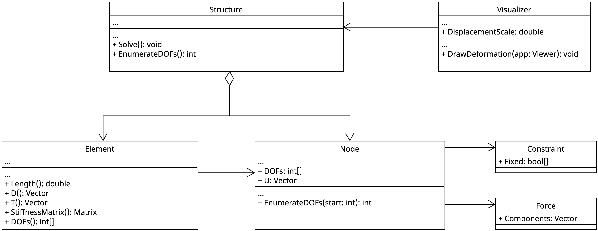
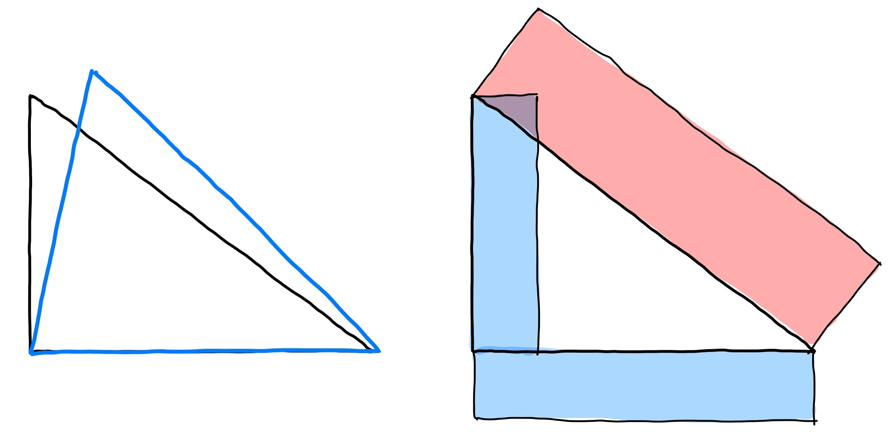
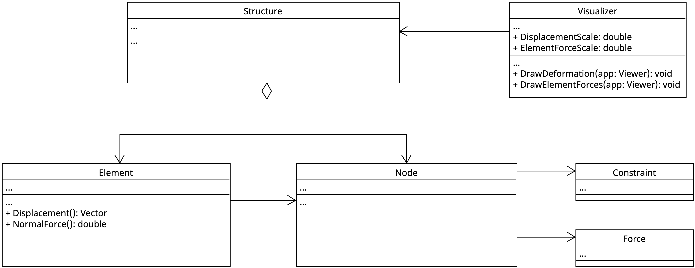

# Design and implementation {#sec-design-and-implementation}

In this section, for each of the three analysis phases, a software design is presented and you are guided step by step through the implementation. Of course, there are many other paths to get to the same end goal. Feel free to go your own way if you are familiar with programming and finite element analysis.

One important choice to make is that of the spatial dimension of the structure: should the software analyze plane truss structures or spatial truss structures? For trusses, there is not much difference in theory and implementation. Mostly everything is the same except that position and displacement vectors (and some others) have either two or three entries. However, for the visualization of a spatial structure you need a suitable 3D graphics library. While in Python you can use PyVista for 3D visualization, there is no easy-to-use 3D library for C#.

::: {.callout-tip}
Plane or spatial analysis.

- Python: Consider to perform a 3D analysis and use PyVista for visualization
- C#: Build a software for 2D analysis and use the BoDraw graphics library
- For other programming languages, check the availability of a graphics library

In this chapter, we describe the design and implementation of a 2D analysis tool. However, extension to the spatial case is straightforward, simply add a third component to all arrays.
:::

## Getting started

The first step is to set up your software project and to install the required libraries.

::: {.panel-tabset}
## Implementation in C\#

Also consider the [guidelines](https://matthiasbaitsch.github.io/informatik-master/lernpfad/folien/c/11-arbeiten-mit-projekten.html#/title-slide){target="_blank"} of the Informatics course at Hochschule Bochum.

Steps:

1. Download, unpack and rename the [project template](https://matthiasbaitsch.github.io/informatik-master/lernpfad/folien/c/projekt-hausarbeit-vorlage.zip). Also rename the solution file to `oofem.slnx`.
1. Create the projects `oofem` and `oofem-visualizer` and add them to the solution.
    ```bash
    dotnet new console -o oofem
    dotnet new console -o oofem-visualizer
    dotnet sln add */*.csproj
    ```
1. In order to work with matrices and vectors, you can use the [Math.NET Numerics](https://numerics.mathdotnet.com){target="_blank"} package. Add the lines

    ```xml
    <ItemGroup>
      <PackageReference Include="MathNet.Numerics" Version="5.0.0" />
      <Using Include="MathNet.Numerics.LinearAlgebra.Matrix&lt;double&gt;" Alias="Matrix" />
      <Using Include="MathNet.Numerics.LinearAlgebra.Vector&lt;double&gt;" Alias="Vector" />
    </ItemGroup>
    ```

    to the `oofem.csproj` file. The `PackageReference` line adds the package; the two `Using` lines below simplify its usage.

1. The `oofem-visualizer` project needs BoDraw

    ```
    dotnet add oofem-visualizer/oofem-visualizer.csproj package BoDraw.App
    ```

## Implementation in Python

Steps:

1. Create the projects `oofem` and `oofem-visualizer`.
1. In order to work with matrices and vectors, you can use the [NumPy](https://numpy.org){target="_blank"} package. Install it using pip:

    ```bash
    pip install numpy
    ```

1. The `oofem-visualizer` project needs pyvista. Install it using pip:
  

    ```bash
    pip install pyvista
    ```
:::

## Preprocessing

For preprocessing, we need the classes identified in @sec-analysis-preprocessing along with required methods and attributes. @fig-class-diagram-1 shows a possible software design in a UML class diagram.

{#fig-class-diagram-1}

Notes on the class diagram in @fig-class-diagram-1:

- For simplicity, all attributes are public. We use capital first letters for attributes and methods; adapt this to the programming style of your language of choice.
- The software design is intentionally simple. It can later be extended as needed, e.g., by introducing an abstract element class with concrete subclasses for trusses and beams.
- The `Constraint` and `Force` classes are just holders of an array. An alternative would have been to directly introduce a boolean and a double array to the node class for constraints and forces.

Regarding the data types in the class diagram:

- `List`: An ordered collection which can grow (array in Python, `List` in C#)
- `Vector`: A type representing mathematical vectors (NumPy in Python, Math.NET Numerics in C#)
- `type[]`: Standard array type

### Implement structural classes

Implement the classes for the structure as shown in @fig-class-diagram-1. The following code fragment establishes the model in @fig-system-example and can be used for testing purposes. If your code is for 3D models, include the third coordinate 0 and fix all nodes in $\mathbf{e}_3$ direction.

```{.csharp include="oofem-csharp/oofem/Program.cs" start-line=1 end-line=15}
```

A nicely formatted output of the `Print` method is given here.

```{.raw-output}
──────────────────────────────────────────────────────────────────
                          N O D E S
──────────────────────────────────────────────────────────────────
         Position               Constraint       Force
         X           Y          Cx     Cy        Fx          Fy
──────────────────────────────────────────────────────────────────
  0      0.0000      0.0000      X      X                        
  1      4.0000      0.0000             X                        
  2      0.0000      3.0000                   1200.00            
──────────────────────────────────────────────────────────────────

──────────────────────────────────────────────────────────────────
                         E L E M E N T S
──────────────────────────────────────────────────────────────────
                 E              A
──────────────────────────────────────────────────────────────────
  0    10000000000         0.0001
  1    10000000000         0.0001
  2    10000000000         0.0001
──────────────────────────────────────────────────────────────────
```

::: {.callout-tip}
Use a very simple output without any formatting first and make the program run. Improve the output at the very end of this step.
:::

### Implement visualization

Program the `Visualizer` class as shown in the UML class diagram in @fig-class-diagram-1.

::: {.columns}
::: {.column width=45%}
```{.csharp include="oofem-csharp/oofem-visualizer/Program.cs" start-line=1 end-line=22}
```
:::
::: {.column width=5%}
:::
::: {.column width=50%}
[]{}

The code to the left shows how the `Visualizer` class is used with the `BoDraw` drawing package (adapt to your needs) and below an idea, how the result might look like.

{width="80%"}

Using triangles (or cones in 3D) is a simple yet effective way to visualize constraints. For the moment, the constraint symbol size and the force scale are set manually in the code (left). In a later stage, this should be done automatically.
:::
:::

## Processing

The additional methods needed for the processing step are shown in @fig-class-diagram-2. We now implement them step by step.

{#fig-class-diagram-2}

### Implementation of element stiffness matrix

Let $\mathbf{X}^{e1}$ and $\mathbf{X}^{e2}$ denote the element node positions. Then, with the element length 

$$
l^e = \|\mathbf{X}^{e2} - \mathbf{X}^{e1}\|,
$$

the direction vector 

$$
\mathbf{d}^e = \frac{1}{l^e} (\mathbf{X}^{e2} - \mathbf{X}^{e1})
$$ 

and the transformation vector 

$$
\mathbf{t}^e 
= 
\left[\begin{array}{c}-\mathbf{d}^e \\ \phantom{-}\mathbf{d}^e\end{array}\right]
$$

the element stiffness matrix is

$$
\mathbf{K}^e = \frac{EA}{l} \mathbf{t}^e (\mathbf{t}^e)^T.
$$

Note that the transformation vector has four entries in 2D and six entries in 3D. The product $\mathbf{t}^e (\mathbf{t}^e)^T$ is actually a matrix since we multiply a column vector with a row vector. Such a product is called a dyadic or outer product of a vector.

In order to test the methods, add the length to the element output and compute the stiffness matrix for element 3. Below is the testing code:

```{.csharp include="oofem-csharp/oofem/Program.cs" start-line=1 end-line=17}
```

and the desired output

```raw-output
──────────────────────────────────────────────────────────────────
                          N O D E S
──────────────────────────────────────────────────────────────────
         Position               Constraint       Force
         X           Y          Cx     Cy        Fx          Fy
──────────────────────────────────────────────────────────────────
  0      0.0000      0.0000      X      X                        
  1      4.0000      0.0000             X                        
  2      0.0000      3.0000                   1200.00            
──────────────────────────────────────────────────────────────────

──────────────────────────────────────────────────────────────────
                         E L E M E N T S
──────────────────────────────────────────────────────────────────
                 E         A              L
──────────────────────────────────────────────────────────────────
  0    10000000000         0.0001         4.0000
  1    10000000000         0.0001         3.0000
  2    10000000000         0.0001         5.0000
──────────────────────────────────────────────────────────────────

K3
DenseMatrix 4x4-Double
 128000  -96000  -128000   96000
 -96000   72000    96000  -72000
-128000   96000   128000  -96000
  96000  -72000   -96000   72000
```

### Implementation of DOF enumeration

In finite element analysis, there exist many approaches to handle degrees of freedom. We take an approach, where the linear system only includes actual degrees of freedom (not fixed by a constraint). Correspondingly, an entry of the `DOFs` vector of a node contains a value of $-1$ if the node is fixed in that direction. The purpose of the `EnumerateDOFs` method in the `Node` class is to collect the degree of freedom indices of a node given a starting number. The corresponding method in the `Structure` class invokes the method for each node and returns the total number of degrees of freedom. The `DOFs` method in `Element` simply concatenates the DOF arrays of the two nodes.

Implement the `EnumerateDOFs` methods in `Structure` and `Node` as well as the `DOFs` method in the `Element` class. You can use this code for testing:


::: {.panel-tabset}

## Implementation in C\#

```{.csharp include="oofem-csharp/oofem/Program.cs" start-line=20 end-line=30}
```

## Implementation in Python

```{.python include="oofem-python/oofem/main.py" start-line=48 end-line=57}
```
:::

and the correct output for our example

```raw-output
Number of DOFs: 3
Node 0 has DOFs [-1, -1]
Node 1 has DOFs [0, -1]
Node 2 has DOFs [1, 2]
Element 0 has DOFs [-1, -1, 0, -1]
Element 1 has DOFs [-1, -1, 1, 2]
Element 2 has DOFs [1, 2, 0, -1]
```

### Implementation of solution procedure

The `Solve` method of the structure class performs the following tasks:

1. Enumerate DOFs using its own `EnumerateDOFs` method
1. Initialize system stiffness matrix and load vector with zeros using the size `N` from the first step
1. Loop over each element of the structure
    - Compute the element stiffness matrix $\mathbf{K}^e$ and store its DOFs in a variable `dofs`
    - Use two nested loops for the element DOFs `i` and `j`
    - The corresponding system DOFs are `I = dofs[i]` and `J = dofs[j]`
    - If neither `I` nor `J` equals -1, add the local stiffness matrix entry $K^e_{ij}$ to the system matrix $K_{IJ}$
1. Use the same approach to assemble the system load vector $\mathbf{r}$
1. Solve the linear system $\mathbf{K}\mathbf{u} = \mathbf{r}$ 
1. Extract nodal displacements using the relation $u^n_i = u_I$ where again, $I$ is the system DOF corresponding to the nodal dof $i$


Implement the `Solve` method in very small steps and print out intermediate results. For the example structure, use

$$
\mathbf{K} =
\left[
  \begin{array}{rrr}
   378000 & -128000 &  96000 \\
  -128000 &  128000 & -96000 \\
    96000 &  -96000 & 405333
  \end{array}
\right]
\quad \text{and} \quad
\mathbf{r} =
\left[
  \begin{array}{c}
    0 \\
    1200 \\
    0
  \end{array}
\right]
$$

as a reference. The final result can be verified by the following code and output.

::: {.panel-tabset}

## Implementation in C\#

```{.csharp include="oofem-csharp/oofem/Program.cs" start-line=32 end-line=33}
```

## Implementation in Python

```{.python include="oofem-python/oofem/main.py" start-line=59 end-line=66}
```
:::

```raw-output
Node 2 has displacement [0.0162, 0.0027]
```

## Postprocessing

With the nodal displacements available, the last step is to compute the normal force in each element and to present the results, both as formatted text output and as pictures of the deformed structure and the element normal forces as in @fig-postprocessing.

{#fig-postprocessing width="70%"}

 @fig-class-diagram-3 shows the additional methods needed for this step, building on the classes already implemented.

{#fig-class-diagram-3}

### Compute element normal force

The normal force in an element follows from its elongation. Using the nodal displacement vector of the element

$$
\mathbf{u}^e = \left[\begin{array}{c}\mathbf{u}^{n1} \\ \mathbf{u}^{n2}\end{array}\right],
$$

with the same layout as the transformation vector $\mathbf{t}^e$ introduced earlier, the elongation is $\mathbf{t}^e \cdot \mathbf{u}^e$ and the normal force is

$$
N^e = \frac{EA}{l^e} \; \mathbf{t}^e \cdot \mathbf{u}^e.
$$

Implement a `Displacement` method in `Element` that concatenates the displacement vectors of the two nodes (analogous to the `DOFs` method) and a `NormalForce` method evaluating the formula above. Test your implementation by computing the normal force of element 3 right after solving:

::: {.panel-tabset}

## Implementation in C\#

```{.csharp include="oofem-csharp/oofem/Program.cs" start-line=34 end-line=34}
```

## Implementation in Python

```{.python include="oofem-python/oofem/main.py" start-line=68 end-line=69}
```
:::

```raw-output
N3 = -1500
```

### Print analysis results

Analogous to the `Print` method from the preprocessing step, implement a `PrintResults` method in `Structure` that outputs a table with the nodal displacements and a table with the element normal forces.

::: {.panel-tabset}

## Implementation in C\#

```{.csharp include="oofem-csharp/oofem/Program.cs" start-line=35 end-line=35}
```

## Implementation in Python

```{.python include="oofem-python/oofem/main.py" start-line=71 end-line=71}
```
:::

```{.raw-output}
──────────────────────────────────────────────────────────────────
                     N O D E   R E S U L T S
──────────────────────────────────────────────────────────────────
                Ux              Uy
──────────────────────────────────────────────────────────────────
  0       0.000000       0.000000
  1       0.004800       0.000000
  2       0.016200       0.002700
──────────────────────────────────────────────────────────────────

──────────────────────────────────────────────────────────────────
                  E L E M E N T   R E S U L T S
──────────────────────────────────────────────────────────────────
    Normal force N
──────────────────────────────────────────────────────────────────
  0    1200.000000
  1     900.000000
  2   -1500.000000
──────────────────────────────────────────────────────────────────
```

### Visualize deformation

To visualize the deformation, draw for each element both the undeformed shape (a thin line between the node positions) and, scaled by a factor `DisplacementScale`, the deformed shape (a thicker, colored line between the node positions shifted by the nodal displacements). Implement a `DrawDeformation` method in `Visualizer` analogous to `DrawSystem`.

::: {.panel-tabset}

## Implementation in C\#

```{.csharp include="oofem-csharp/oofem-visualizer/Program.cs" start-line=26 end-line=28}
```

## Implementation in Python

```{.python include="oofem-python/oofem-visualizer/main.py" start-line=145 end-line=148}
```
:::

### Visualize element normal forces

To visualize the element normal forces, draw for each element a colored band next to the element line, offset perpendicular to the element axis by an amount proportional to the normal force and scaled by a factor `ElementForceScale`. Use, for example, blue for tension (positive normal force) and red for compression (negative normal force). Implement a `DrawElementForces` method in `Visualizer` analogous to `DrawDeformation`.

::: {.panel-tabset}

## Implementation in C\#

```{.csharp include="oofem-csharp/oofem-visualizer/Program.cs" start-line=30 end-line=32}
```

## Implementation in Python

```{.python include="oofem-python/oofem-visualizer/main.py" start-line=155 end-line=157}
```
:::


