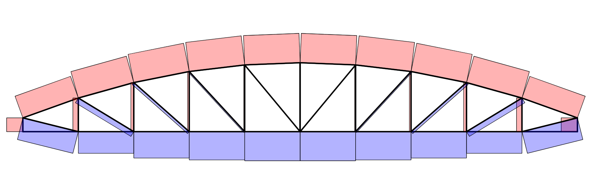

# Possible program extensions

## Basic usability extensions

### Choose `Visualizer` scalings automatically

So far, you needed to set the sizes and scaling factors in the visualizer manually. Of course, this is quite inconvenient. Therefore, the first extension would be to introduce an automatic scaling method to the visualizer class which is invoked at the beginning of each draw method. The idea is to use a system size as reference value and to define all other sizes with respect to this quantity.

::: {.callout-tip}
A good indicator for the system size is the geometric mean of the structure extents

$$
    \sqrt{d_1 \cdot d_2} \quad \text{in 2D or} \quad \sqrt[3]{d_1 \cdot d_2 \cdot d_3} \quad \text{in 3D}
$$

where $d_i$ is the difference between the maximum and minimum node coordinate $i$.
:::

Of course, for forces, deformation and element forces you also need the maximum values or the value range respectively. Here is a basic idea of how the automatic scaling can be achieved.

::: {.panel-tabset}

## C\#

```csharp
public class Visualizer
{
    ...

    public void DrawSystem(IBoDraw bd)
    {
        this.UpdateParameters();
        ...
    }

    ...

    public void UpdateParameters()
    {
        double size = this.SystemSize();
        double maxF = this.Structure.Nodes.Max(n => n.Force.Components.Norm(2));
        ...
        this.ConstraintSize = ...;
        ...
    }

    public double SystemSize()
    {
        ...
    }
}
```

In order to obtain minimum/maximum values of quantities related to nodes and elements, you can use the `Min`/`Max` methods of the `List` class. The parameter to this method is a function which extracts the quantity of interest for the respective object. For instance, the expression

```csharp
n => n.Force.Components.Norm(2)
```

is a function which returns the force magnitude for node `n`. You can read the term as `n` is mapped onto the magnitude of the applied force.

## Python

```python
class Visualizer:

    ...

    def draw_model(self):
        self.update_parameters()
        ...

    def update_parameters(self):
        size = self.system_size()
        ...
        self.constraint_scale = ...

    def system_size(self) -> float:
        ...    
```
:::

### Read structure from an Excel file

Defining a structure using program code can be efficient but in some situations, it can be better to use another file format such as an Excel workbook. Consider for instance the introductory example ([2D](oofem-csharp/oofem-examples/structures/guide-example.xlsx){download="guide-example.xlsx"}/[3D](oofem-python/oofem-examples/structures/guide-example.xlsx){download="guide-example-3d.xlsx"}). Another example is the truss girder ([2D](oofem-csharp/oofem-examples/structures/girder.xlsx){download="girder.xlsx"}/[3D](oofem-python/oofem-examples/structures/girder.xlsx){download="girder-3d.xlsx"}) shown in @fig-girder below.

{#fig-girder width=70%}

The following code fragments should give you an idea of how this works.

::: {.panel-tabset}

## C\#

```{.csharp filename="ReadExcel.cs"}
using NPOI.SS.UserModel;
using NPOI.XSSF.UserModel;

public static class ExcelReader
{
    public static Structure Read(string file)
    {
        Structure structure = new Structure();
        XSSFWorkbook workbook = new XSSFWorkbook(file);
        workbook.MissingCellPolicy = MissingCellPolicy.CREATE_NULL_AS_BLANK;

        ISheet nodesSheet = workbook.GetSheetAt(0);
        for (int i = 1; i <= nodesSheet.LastRowNum; i++)
        {
            IRow row = nodesSheet.GetRow(i);
            Node node = structure.AddNode(row.GetCell(0).NumericCellValue, row.GetCell(1).NumericCellValue);
            ...
        }

        ...

        return structure;
    }
}
```

You can use this code in your program like this:

```csharp
Structure s = ExcelReader.Read("structures/girder.xlsx");
```

The path assumes that the Excel file is in a subfolder `structures` of the current project and that this folder is configured to be copied to the output directory in the `.csproj` project file, see explanation in the reference below.

Please also consider the [material](https://matthiasbaitsch.github.io/informatik-master/lernpfad/folien/c/12-werkzeuge.html#/excel-dateien-lesen-und-schreiben){target="_blank"} from the `Informatik`-Module (in German).

## Python

```python
import openpyxl
from structure import Structure

def read_excel(file: str) -> Structure:
    structure = Structure()
    workbook = openpyxl.load_workbook(file, data_only=True)

    nodes_sheet = workbook.worksheets[0]
    for row in nodes_sheet.iter_rows(min_row=2, values_only=True):
        node = structure.add_node(row[0], row[1], row[2])
        ...

    ...

    return structure
```
:::

## Extending the finite element formulation

The finite element program developed in this course can be extended in several directions to solve more sophisticated engineering problems. Some proposals for meaningful extensions of the linear finite element program are given below.

- Extend the object-oriented finite element program to support inhomogeneous Dirichlet boundary conditions.
    - Consideration of inhomogeneous Dirichlet boundary conditions in the node class (accounting for prescribed displacements).
    - Generation of the stiffness matrices $\mathbf{K}_{uu}$, $\mathbf{K}_{ur}$ and $\mathbf{K}_{rr}$ by assembly.
    - Calculation of the unknown structural displacements $\mathbf{u}_u$ and the unknown structural reaction forces $\mathbf{r}_r$.
- Implementing truss elements including prestresses $\sigma_{11}^0$, whereby the total stress is defined by the constitutive law $\sigma_{11} = E\varepsilon_{11} + \sigma_{11}^0$. A non-linear prestressed (Crisfield-type) truss element can be used as the theoretical basis.
    - Calculate the external forces resulting from the prestress $\sigma_{11}^0$.
    - Calculate the geometric stiffness matrix resulting from the prestress $\sigma_{11}^0$.
    - Calculate the structural deformations caused by the prestresses.
    - Calculate the structural deformations caused by prestresses and external loading combined.
    - Compare the prestressed formulation with thermal strains, where the total normal strain is defined by $\varepsilon_{11} = u_{1,1} + \alpha [\theta - \theta_0]$ ($u_{1,1}$: deformation-caused strain, $\alpha$: thermal expansion coefficient, $\theta$: current temperature, $\theta_0$: reference temperature).
- Extend the object-oriented finite element program for simulations of linear structural dynamics (compare @bathe96 or @numdynskript).
    - Calculate the element mass matrix and the structural mass matrix.
    - Include transient external loading.
    - Generate the structural damping matrix according to the Rayleigh damping model.
    - Implement the eigenvalue analysis solving the generalized eigenvalue problem $[\mathbf{K} - \omega^2 \mathbf{M}] \boldsymbol{\Phi} = \mathbf{0}$.
    - Implement a time integration scheme to solve the semidiscrete initial value problem defined by the equation of motion $\mathbf{M}\ddot{\mathbf{u}} + \mathbf{D}\dot{\mathbf{u}} + \mathbf{K}\mathbf{u} = \mathbf{r}(t)$ and the initial conditions $\ddot{\mathbf{u}}_0$, $\dot{\mathbf{u}}_0$ and $\mathbf{u}_0$. The central difference method or the Newmark-$\alpha$ scheme are proposed for this course.
- Extend the object-oriented finite element program for simulations of non-linear structural mechanics (compare @crisfield91, @crisfield97, @belytschkoliumoran00 or @fem2skript).
    - Calculate the element vector of internal forces and the element tangent stiffness matrix.
    - Assemble these quantities into the associated structural quantities.
    - Implement an algorithm for the non-linear static analysis of structures, for example a load-controlled Newton-Raphson scheme.
    - Implement an arc-length method including the Newton-Raphson iteration.
- Extend the object-oriented finite element program for simulations of three-dimensional elasticity.
    - Develop and implement a three-dimensional volume element with eight nodes. Use Gauss integration to determine the element stiffness matrix.
    - Apply this element to the linear static analysis of a cantilever beam subjected to vertical and horizontal loading.
    - Study the convergence achieved with different finite element meshes.


